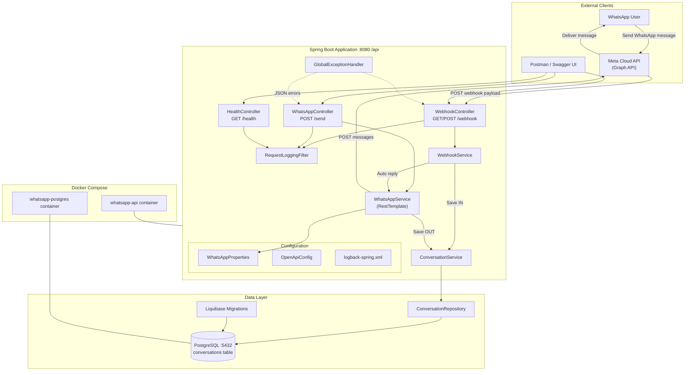

# WhatsApp Cloud API POC

Spring Boot application for sending WhatsApp messages, receiving Meta webhooks, storing conversations in PostgreSQL, and sending automatic replies.

## Architecture



### Request flows

**1. Send message (`POST /api/send`)**
```
Client → WhatsAppController → WhatsAppService → Meta Graph API
                              → ConversationService → PostgreSQL (direction=OUT)
```

**2. Receive webhook (`POST /api/webhook`)**
```
Meta → WebhookController → WebhookService → ConversationService → PostgreSQL (direction=IN)
                                          → WhatsAppService → Meta Graph API (auto reply)
                                          → ConversationService → PostgreSQL (direction=OUT)
```

## Feature Verification

| # | Feature | Status | Implementation |
|---|---|---|---|
| 1 | Send WhatsApp Message | ✅ | `WhatsAppController` → `WhatsAppService` → Meta Graph API via `RestTemplate` |
| 2 | Receive WhatsApp Response | ✅ | `WebhookController` → `WebhookService` parses Meta webhook payload |
| 3 | Save in PostgreSQL | ✅ | `ConversationService` persists `IN` (webhook) and `OUT` (send/auto-reply) via Liquibase schema |
| 4 | Auto Reply | ✅ | `WebhookService` triggers `WhatsAppService.sendAutoReply()` after inbound save |
| 5 | Docker Support | ✅ | Multi-stage `Dockerfile` + `docker-compose.yml` (app + postgres, health checks, log volume) |
| 6 | Swagger | ✅ | `OpenApiConfig` + springdoc at `/api/swagger-ui.html` |
| 7 | Logging | ✅ | SLF4J + `logback-spring.xml` + `RequestLoggingFilter` + domain loggers |

## Tech Stack

| Technology | Version |
|---|---|
| Java | 17 |
| Spring Boot | 3.5 |
| Maven | 3.9+ |
| PostgreSQL | 16 |
| Liquibase | (via Spring Boot) |
| Swagger / OpenAPI | springdoc 2.x |
| Docker | Multi-stage build |

## API Endpoints

Base URL: `http://localhost:8080/api`

| Method | Path | Description |
|---|---|---|
| GET | `/health` | Health check |
| POST | `/send` | Send outbound WhatsApp message |
| GET | `/webhook` | Meta webhook verification |
| POST | `/webhook` | Receive inbound WhatsApp messages |
| GET | `/swagger-ui.html` | Swagger UI (dev) |
| GET | `/v3/api-docs` | OpenAPI JSON |

---

## Setup

### Prerequisites

- Java 17+
- Maven 3.9+
- PostgreSQL 16+ (or use Docker)
- Meta Developer account with WhatsApp Cloud API access

### 1. Clone and configure

```bash
git clone <repository-url>
cd whatsapp-cloud-api-poc
cp .env.example .env
```

Edit `.env` or set environment variables (see [Meta Configuration](#meta-configuration)).

### 2. Create the database

```sql
CREATE DATABASE whatsapp_db;
```

Or start PostgreSQL via Docker (see [Docker](#docker)).

### 3. Run locally

```bash
mvn spring-boot:run
```

The app starts on **http://localhost:8080/api**. Liquibase creates the `conversations` table on first run.

### 4. Verify

```bash
curl http://localhost:8080/api/health
```

Expected response:

```json
{"status":"UP"}
```

---

## Database

### Schema

Table: `conversations`

| Column | Type | Description |
|---|---|---|
| `id` | BIGSERIAL | Primary key |
| `mobile` | VARCHAR(20) | Sender/recipient mobile (country code, no `+`) |
| `message` | TEXT | Message body |
| `direction` | VARCHAR(10) | `IN` or `OUT` |
| `created_at` | TIMESTAMP | Message timestamp |

### Migrations

Schema is managed by **Liquibase**:

- Master changelog: `src/main/resources/db/changelog/db.changelog-master.yaml`
- Initial migration: `src/main/resources/db/changelog/changes/001-create-conversations-table.sql`

Manual SQL (optional):

```bash
psql -U postgres -d whatsapp_db -f src/main/resources/db/schema/conversations.sql
```

### Connection settings

| Variable | Default |
|---|---|
| `SPRING_DATASOURCE_URL` | `jdbc:postgresql://localhost:5432/whatsapp_db` |
| `SPRING_DATASOURCE_USERNAME` | `postgres` |
| `SPRING_DATASOURCE_PASSWORD` | `postgres` |

### Query example

```sql
SELECT id, mobile, message, direction, created_at
FROM conversations
ORDER BY created_at DESC;
```

---

## Docker

### Quick start

```bash
cp .env.example .env
# Edit .env with your Meta credentials and a strong POSTGRES_PASSWORD

docker compose up -d --build
```

### Services

| Service | Container | Port |
|---|---|---|
| Spring Boot | `whatsapp-api` | 8080 |
| PostgreSQL | `whatsapp-postgres` | 5432 |

### Useful commands

```bash
# View logs
docker compose logs -f app

# Stop services
docker compose down

# Stop and remove volumes (deletes DB data)
docker compose down -v

# Rebuild after code changes
docker compose up -d --build
```

### Production notes

- Change `POSTGRES_PASSWORD` in `.env` before deploying.
- Set `SWAGGER_ENABLED=false` in production (default in Docker).
- Application logs are written to `/app/logs` inside the container.
- Health checks run on both `app` and `postgres` services.

---

## Meta Configuration

### 1. Create a Meta app

1. Go to [Meta for Developers](https://developers.facebook.com/).
2. Create an app → select **Business** type.
3. Add the **WhatsApp** product to your app.

### 2. Get credentials

From **WhatsApp → API Setup** in the Meta Developer Console:

| Credential | Environment variable | `application.yml` key |
|---|---|---|
| Temporary / permanent access token | `WHATSAPP_TOKEN` | `whatsapp.token` |
| Phone number ID | `WHATSAPP_PHONE_NUMBER_ID` | `whatsapp.phoneNumberId` |
| Custom verify token (you choose) | `WHATSAPP_VERIFY_TOKEN` | `whatsapp.verifyToken` |

### 3. Configure the application

**Option A — environment variables (recommended):**

```bash
export WHATSAPP_TOKEN=EAAxxxxx
export WHATSAPP_PHONE_NUMBER_ID=123456789012345
export WHATSAPP_VERIFY_TOKEN=my-secret-verify-token
export WHATSAPP_AUTO_REPLY_MESSAGE="Thank you for contacting us."
```

**Option B — `.env` file for Docker:**

```env
WHATSAPP_TOKEN=EAAxxxxx
WHATSAPP_PHONE_NUMBER_ID=123456789012345
WHATSAPP_VERIFY_TOKEN=my-secret-verify-token
WHATSAPP_AUTO_REPLY_MESSAGE=Thank you for contacting us.
```

### 4. Add test recipients

In development mode, add recipient phone numbers under **WhatsApp → API Setup → To** before you can message them.

---

## Webhook Setup

Meta must reach your server over HTTPS. For local development, use a tunnel such as [ngrok](https://ngrok.com/).

### 1. Start the app and expose it

```bash
mvn spring-boot:run
ngrok http 8080
```

Note your public URL, e.g. `https://abc123.ngrok.io`.

### 2. Configure webhook in Meta

In **WhatsApp → Configuration → Webhook**:

| Field | Value |
|---|---|
| **Callback URL** | `https://abc123.ngrok.io/api/webhook` |
| **Verify token** | Same value as `WHATSAPP_VERIFY_TOKEN` |

Click **Verify and save**.

### 3. Subscribe to webhook fields

Subscribe to at least:

- `messages`

### 4. Verification flow

Meta sends:

```
GET /api/webhook?hub.mode=subscribe&hub.verify_token=<token>&hub.challenge=<random>
```

If the verify token matches, the app returns `hub.challenge` with HTTP 200. Otherwise it returns 403.

### 5. Incoming message flow

```
User sends message → Meta POST /api/webhook → Save to DB (direction=IN) → Auto reply sent
```

---

## Testing

### Run unit tests

```bash
mvn test
```

Tests use an in-memory H2 database with the `test` profile.

### Manual API tests

**Health check:**

```bash
curl http://localhost:8080/api/health
```

**Send message:**

```bash
curl -X POST http://localhost:8080/api/send \
  -H "Content-Type: application/json" \
  -d "{\"mobile\":\"917506426501\",\"message\":\"Hello User\"}"
```

**Webhook verification:**

```bash
curl "http://localhost:8080/api/webhook?hub.mode=subscribe&hub.verify_token=your-verify-token&hub.challenge=1234567890"
```

**Simulate inbound webhook:**

```bash
curl -X POST http://localhost:8080/api/webhook \
  -H "Content-Type: application/json" \
  -d @- <<'EOF'
{
  "object": "whatsapp_business_account",
  "entry": [{
    "id": "WHATSAPP_BUSINESS_ACCOUNT_ID",
    "changes": [{
      "field": "messages",
      "value": {
        "messaging_product": "whatsapp",
        "messages": [{
          "from": "917506426501",
          "id": "wamid.example",
          "timestamp": "1710000000",
          "type": "text",
          "text": { "body": "Hello" }
        }]
      }
    }]
  }]
}
EOF
```

### Swagger UI

Open **http://localhost:8080/api/swagger-ui.html** to explore and try endpoints interactively.

---

## Postman Examples

Import these into Postman or use as cURL references. Set a collection variable `baseUrl = http://localhost:8080/api`.

### 1. Health Check

```
GET {{baseUrl}}/health
```

### 2. Send WhatsApp Message

```
POST {{baseUrl}}/send
Content-Type: application/json

{
  "mobile": "917506426501",
  "message": "Hello User"
}
```

**Success response (200):**

```json
{
  "messaging_product": "whatsapp",
  "contacts": [
    {
      "input": "917506426501",
      "wa_id": "917506426501"
    }
  ],
  "messages": [
    {
      "id": "wamid.HBgL..."
    }
  ]
}
```

### 3. Webhook Verification

```
GET {{baseUrl}}/webhook?hub.mode=subscribe&hub.verify_token=your-verify-token&hub.challenge=1234567890
```

**Success response (200):** plain text body `1234567890`

### 4. Receive Webhook (Inbound Message)

```
POST {{baseUrl}}/webhook
Content-Type: application/json

{
  "object": "whatsapp_business_account",
  "entry": [
    {
      "id": "WHATSAPP_BUSINESS_ACCOUNT_ID",
      "changes": [
        {
          "field": "messages",
          "value": {
            "messaging_product": "whatsapp",
            "metadata": {
              "display_phone_number": "15550001234",
              "phone_number_id": "PHONE_NUMBER_ID"
            },
            "contacts": [
              {
                "profile": { "name": "User" },
                "wa_id": "917506426501"
              }
            ],
            "messages": [
              {
                "from": "917506426501",
                "id": "wamid.example",
                "timestamp": "1710000000",
                "type": "text",
                "text": {
                  "body": "Hello"
                }
              }
            ]
          }
        }
      ]
    }
  ]
}
```

**Success response (200):** empty body. Check logs and database for saved message + auto reply.

### Postman environment variables

| Variable | Example |
|---|---|
| `baseUrl` | `http://localhost:8080/api` |
| `whatsappToken` | `EAAxxxxx` |
| `verifyToken` | `your-verify-token` |
| `testMobile` | `917506426501` |

---

## Troubleshooting

### Webhook verification fails (403)

| Cause | Fix |
|---|---|
| Verify token mismatch | Ensure `WHATSAPP_VERIFY_TOKEN` matches Meta Console exactly |
| Wrong callback URL | Use full path: `https://your-domain/api/webhook` (include `/api`) |
| App not reachable | Confirm tunnel/ngrok is running and points to port 8080 |

### Messages not sending (502 / WhatsApp API error)

| Cause | Fix |
|---|---|
| Invalid or expired token | Generate a new token in Meta Developer Console |
| Wrong phone number ID | Copy **Phone number ID** from API Setup (not the display number) |
| Recipient not allowed | Add number to test recipients (development mode) |
| Invalid mobile format | Use digits only with country code, e.g. `917506426501` (no `+`) |

### Database connection errors

| Cause | Fix |
|---|---|
| PostgreSQL not running | Start DB or run `docker compose up postgres -d` |
| Wrong credentials | Check `SPRING_DATASOURCE_*` variables |
| Database missing | Run `CREATE DATABASE whatsapp_db;` |
| Liquibase failure | Check logs; ensure DB user has CREATE TABLE permission |

### Docker app won't start

```bash
docker compose logs app
docker compose logs postgres
```

| Cause | Fix |
|---|---|
| Postgres not healthy | Wait for health check; check `POSTGRES_PASSWORD` |
| Port in use | Stop other services on 8080 or 5432 |
| Build failure | Run `docker compose build --no-cache` |

### Auto reply not sent after webhook

| Cause | Fix |
|---|---|
| Invalid WhatsApp token | Verify `WHATSAPP_TOKEN` and `WHATSAPP_PHONE_NUMBER_ID` |
| Non-text webhook payload | Only `type: text` messages trigger auto reply |
| API rate limits | Check application logs for WhatsApp API errors |

### View logs

**Local:**

```bash
tail -f logs/whatsapp-cloud-api-poc.log
```

**Docker:**

```bash
docker compose logs -f app
```

Log categories:

- `RequestLoggingFilter` — HTTP requests
- `WhatsAppService` — API requests/responses
- `WebhookService` — webhook events
- `com.example.whatsapp.database` — DB inserts
- `GlobalExceptionHandler` — exceptions

### Enable Swagger in Docker

Set in `.env`:

```env
SWAGGER_ENABLED=true
```

Then restart: `docker compose up -d app`

---

## Project Structure

```
src/main/java/com/example/whatsapp/
├── config/          # JPA, OpenAPI, RestTemplate, logging
├── controller/      # REST endpoints
├── dto/             # Request/response objects
├── entity/          # JPA entities
├── exception/       # Global exception handling
├── repository/      # Spring Data repositories
├── service/         # Business logic
└── util/            # Constants
```

## License

Apache 2.0
