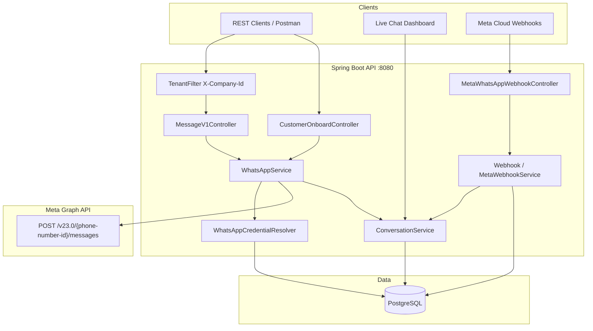
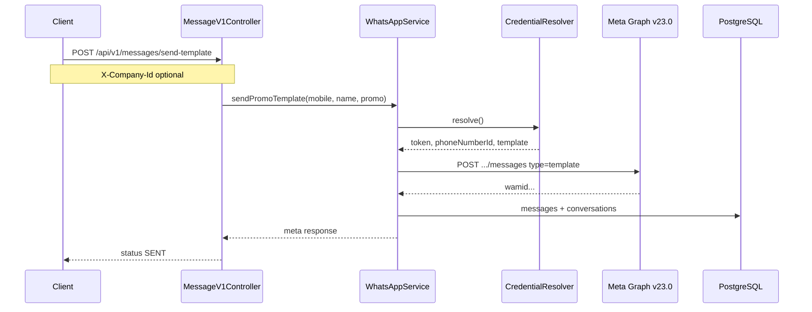

# Altitude Labs WhatsApp Cloud API — Architecture

## Overview

Multi-tenant Spring Boot service that sends WhatsApp messages via Meta Graph API (`v23.0`), receives webhooks, persists conversations in PostgreSQL, and exposes a live chat dashboard.

## Mermaid — System architecture

## Mermaid — Send template sequence

## Multi-tenant model

| Layer | Mechanism |
|---|---|
| Identity | `X-Company-Id` header (default `1` = Altitude Labs) |
| Credentials | `company_whatsapp_config` per company, fallback to `application.yml` |
| Data | `company_id` on customers, messages, conversation |

Unlimited companies: insert into `companies` + `company_whatsapp_config` with that tenant’s Meta token / phone number ID / template.

## Key endpoints

| Method | Path | Purpose |
|---|---|---|
| POST | `/api/v1/messages/send-template` | Marketing template cold send |
| POST | `/api/v1/messages/send` | text / template / image / pdf / video / location / buttons |
| GET/POST | `/api/v1/webhooks/meta/whatsapp` | Meta webhook verify + events |
| GET/POST | `/webhook/whatsapp` | Same webhook (ngrok-friendly) |
| GET | `/api/v1/conversations/{mobile}` | Chat timeline |
| GET | `/swagger-ui.html` | OpenAPI UI |
