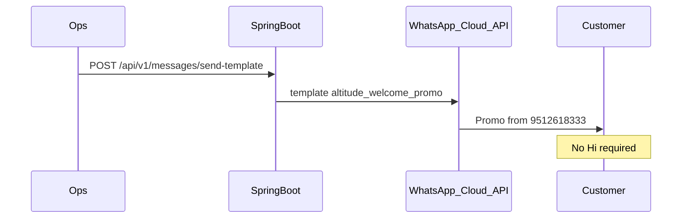

# Altitude Labs — Direct Promo Onboarding (any mobile)

## Why Bharat needed to say Hi

| Message type | Can send without customer messaging first? |
|---|---|
| Free text / CTA / buttons | **NO** — only inside WhatsApp 24-hour session |
| Approved **MARKETING template** | **YES** — cold outreach to any number |

When Bharat said **Hi**, Meta opened a 24h window, so free messages from `+91 9512618333` worked.  
For numbers like **`7718986249`** (or any new lead), you must send an **approved marketing template**.

## Correct flow (direct promo)



## APIs

### 1) Send cold promo to one number

`POST /api/v1/messages/send-template`

```json
{
  "mobile": "917718986249",
  "customerName": "Amit",
  "promoCode": "WELCOME100"
}
```

### 2) Bulk cold promo

`POST /api/v1/messages/send-template/bulk`

```json
{
  "recipients": [
    { "mobile": "917718986249", "customerName": "Amit", "promoCode": "WELCOME100" },
    { "mobile": "917506426501", "customerName": "Harish", "promoCode": "WELCOME100" },
    { "mobile": "917718884343", "customerName": "Bharat", "promoCode": "WELCOME100" }
  ]
}
```

### 3) Onboard + promo (always uses template by default)

`POST /api/v1/customers/onboard`

```json
{
  "mobile": "7718986249",
  "name": "Amit",
  "promoCode": "WELCOME100"
}
```

`messageStyle=cta|text|buttons` is **ignored** unless you set `"allowSessionMessage": true` (only after customer said Hi).

## Meta checklist (must be done once)

1. **WhatsApp Manager → Message templates**  
   Create / approve **`altitude_welcome_promo`**  
   - Category: **Marketing**  
   - Language: **en** (must match API)  
   - Body vars: `{{1}}` = name, `{{2}}` = promo code  

2. Confirm it exists:

`GET /api/v1/meta/templates`

3. In **development mode**, add each test recipient under Meta → WhatsApp → API Setup → **To** (OTP):

- `+91 7718986249`
- `+91 7506426501`
- `+91 7718884343`

4. Keep a valid permanent `WHATSAPP_TOKEN` in `.env` with Phone Number ID `1226308087231072`.

## PowerShell — send to Amit now

```powershell
Invoke-RestMethod -Method Post -Uri http://localhost:8080/api/v1/messages/send-template `
  -ContentType "application/json" `
  -Body '{
    "mobile":"917718986249",
    "customerName":"Amit",
    "promoCode":"WELCOME100"
  }'
```
