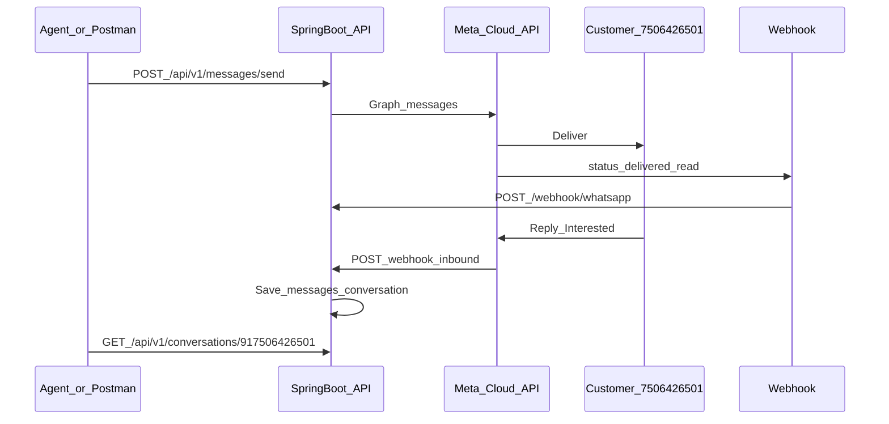

# Altitude Labs — End-to-End WhatsApp Testing

## Architecture



## Config (from env / `.env`)

| Key | Purpose |
|---|---|
| `WHATSAPP_TOKEN` | Permanent access token |
| `WHATSAPP_PHONE_NUMBER_ID` | Phone Number ID for +91 9512618333 |
| `WHATSAPP_BUSINESS_ACCOUNT_ID` | WABA ID |
| `WHATSAPP_VERIFY_TOKEN` | `AltitudeLabs@2026` |

Never commit real tokens. Prefer environment variables.

## Send welcome message

```bash
curl -X POST http://localhost:8080/api/v1/messages/send \
  -H "Content-Type: application/json" \
  -d "{
    \"customerNumber\":\"917506426501\",
    \"customerName\":\"Harish\",
    \"promoCode\":\"WELCOME100\",
    \"message\":\"Hello Harish, welcome to Altitude Labs.\",
    \"type\":\"text\"
  }"
```

Template (first contact / outside 24h window):

```bash
curl -X POST http://localhost:8080/api/v1/messages/send \
  -H "Content-Type: application/json" \
  -d "{
    \"customerNumber\":\"917506426501\",
    \"type\":\"template\",
    \"templateName\":\"hello_world\",
    \"languageCode\":\"en_US\",
    \"message\":\"Welcome\"
  }"
```

## Dashboard

Open `dashboard/index.html` in a browser (or serve via any static server) and point API base to `http://localhost:8080`.

## Angular 20

Scaffold lives under `frontend/` — run `npm install && npm start` after Node 20+ is installed.
