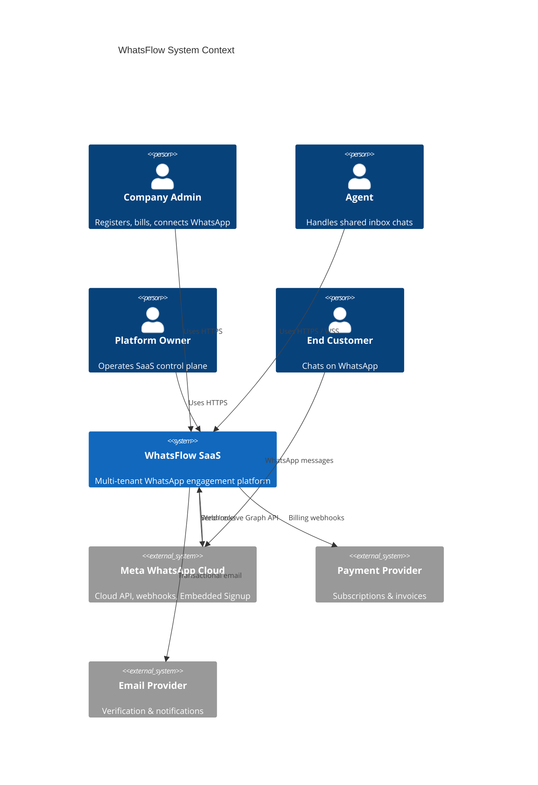
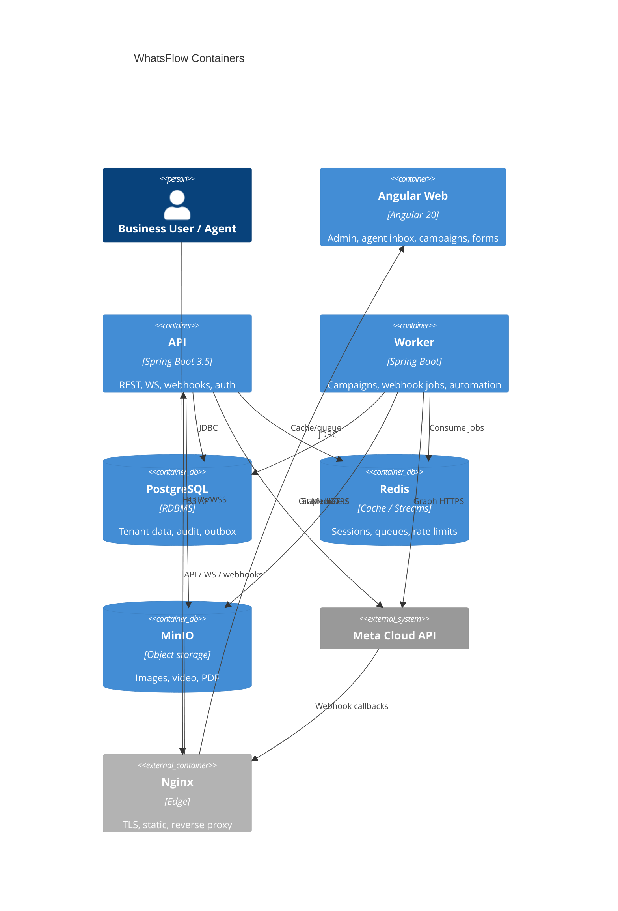
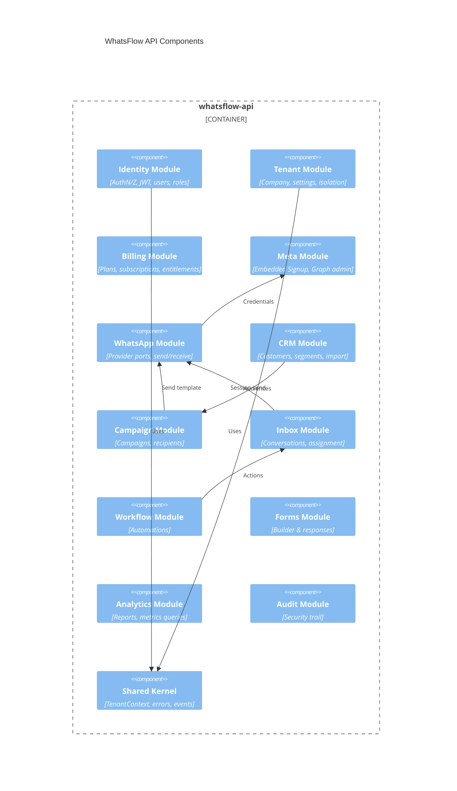

# MASTER-01 — C4 Architecture

## Level 1 — System Context

---

## Level 2 — Containers

---

## Level 3 — API Components (modular monolith)

---

## Level 4 — Code (illustrative, not generated)

Example inbound webhook flow (classes — design only):

1. `MetaWhatsAppWebhookController` (api)  
2. `ProcessWhatsAppWebhookUseCase` (application)  
3. `WebhookEventRepository` (port.out)  
4. `ConversationDomainService` (domain)  
5. `JpaWebhookEventAdapter` / `MetaSignatureVerifier` (infrastructure)  
6. `InboxRealtimePublisher` → WebSocket fan-out  

---

## Deployment view

| Environment | Notes |
|---|---|
| `local` | Docker Compose: api, worker, pg, redis, minio, mailhog |
| `staging` | Single region; Meta test numbers / approved templates |
| `production` | Multi-AZ API/worker; managed PG/Redis; WAF at Nginx/CDN |

---

## Trust boundaries

1. Public internet → Nginx  
2. Meta webhooks → dedicated path, signature verification  
3. Tenant JWT → API application layer  
4. Platform admin → separate role + audit  
5. Secrets vault / env → never logged  
