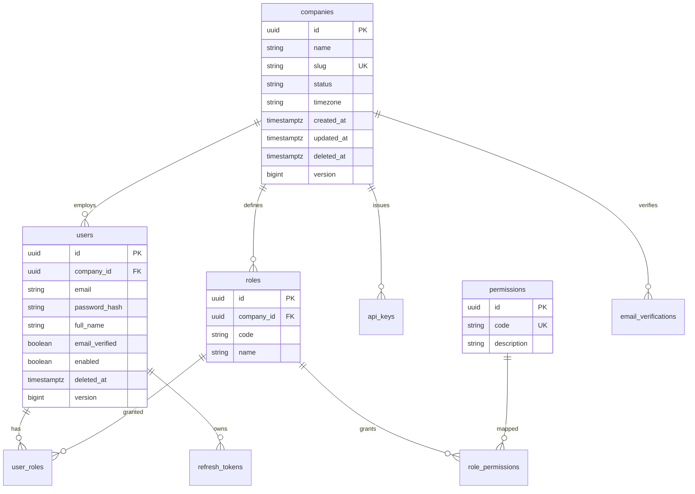
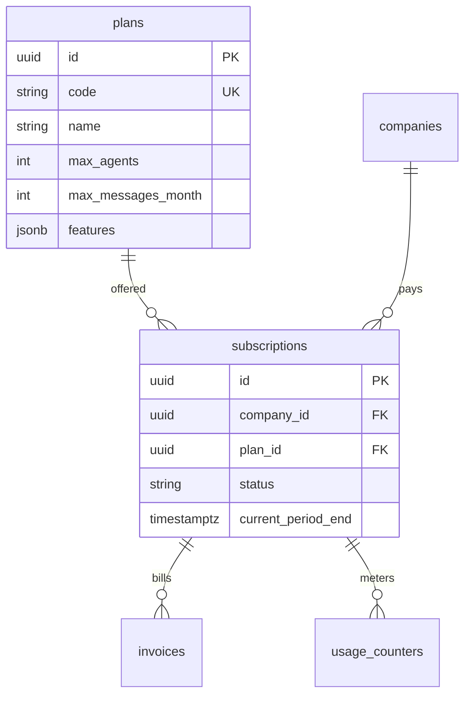
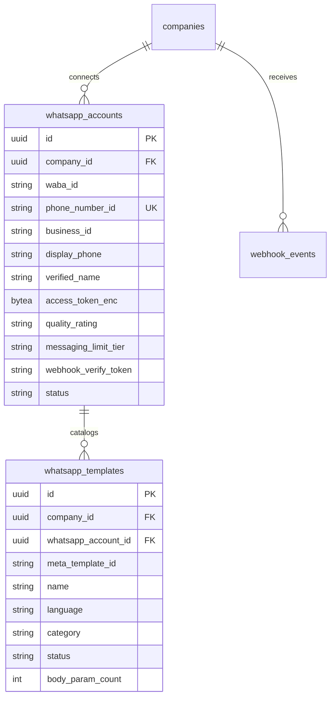
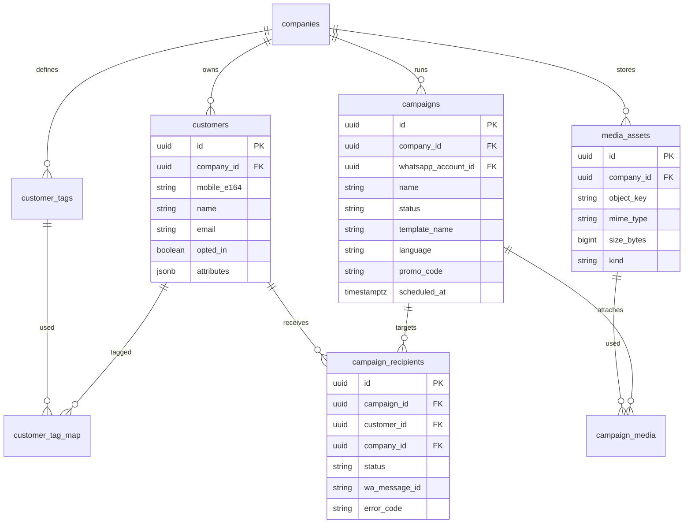
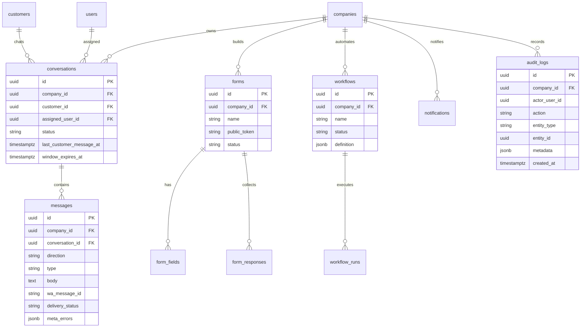

# MASTER-01 — ER Diagram

## 1. Core tenancy & identity

## 2. Billing

## 3. Meta / WhatsApp

## 4. CRM, media, campaigns

## 5. Conversations, agents, forms, workflows

## 6. Isolation invariant

Every business table above (except global `plans`, `permissions`) includes **`company_id`** and is queried only inside tenant scope.
