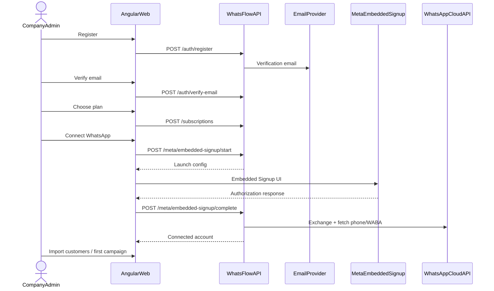
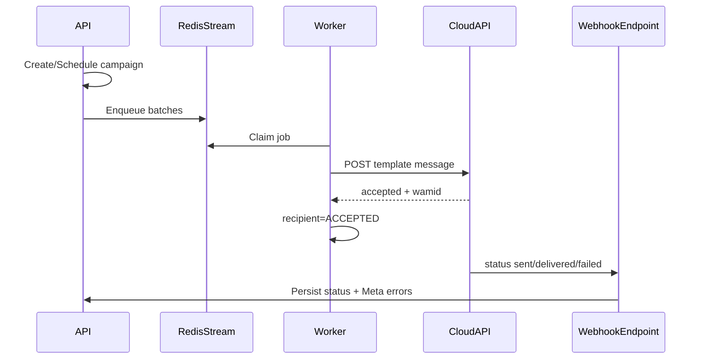
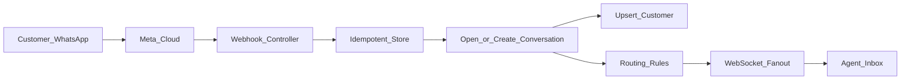
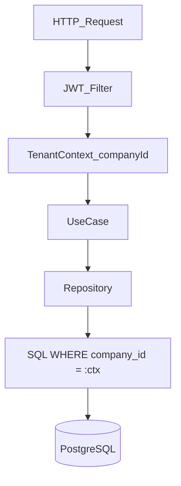
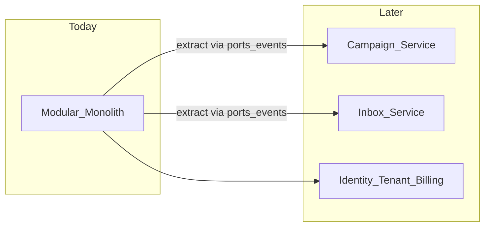
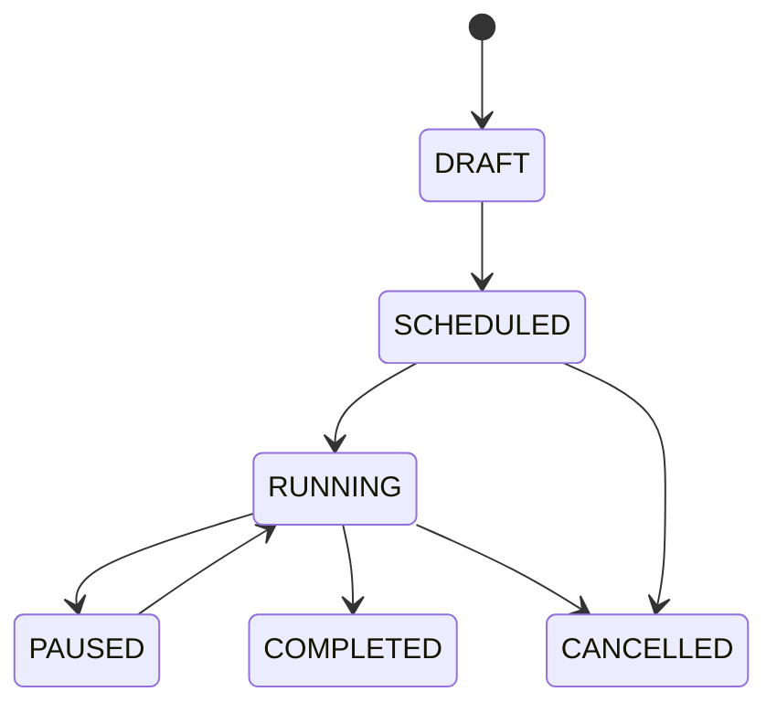
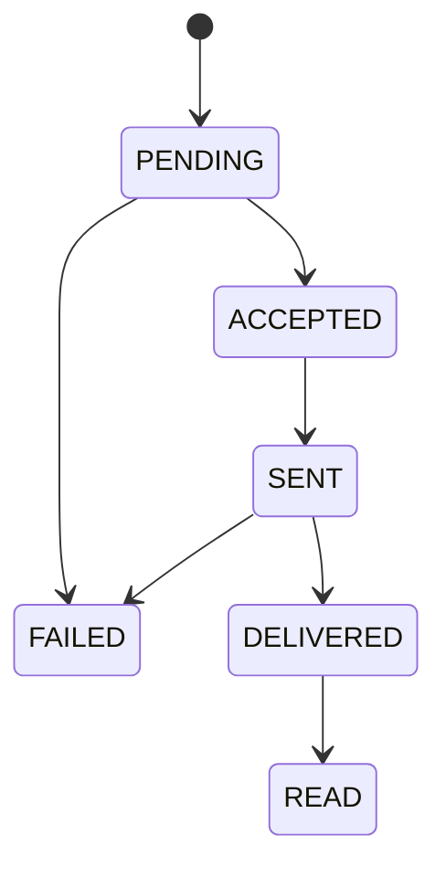
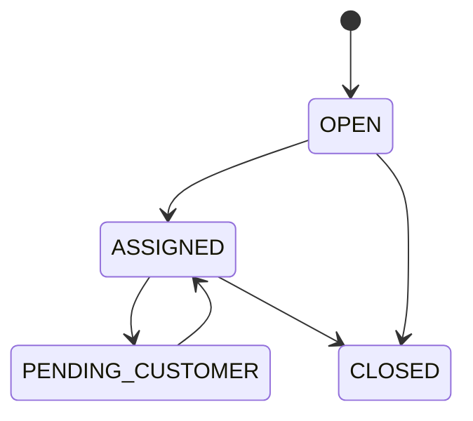
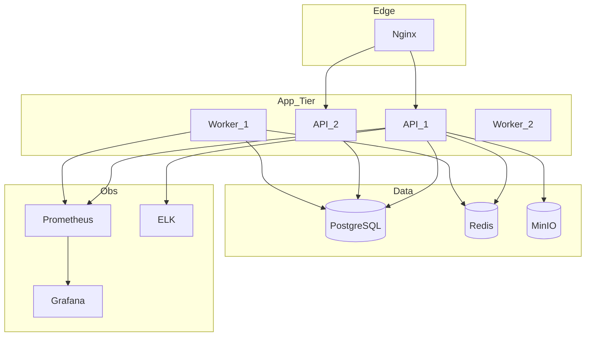

# MASTER-01 — Mermaid Diagrams Pack

Central diagram index. (C4 / ER also live in their own docs.)

---

## 1. Self-serve onboarding sequence

---

## 2. Campaign send + status

---

## 3. Inbound message → inbox

---

## 4. Tenant isolation

---

## 5. Modular monolith → microservice extraction path

---

## 6. State machines

### Campaign

### Campaign recipient

### Conversation

---

## 7. Deployment

