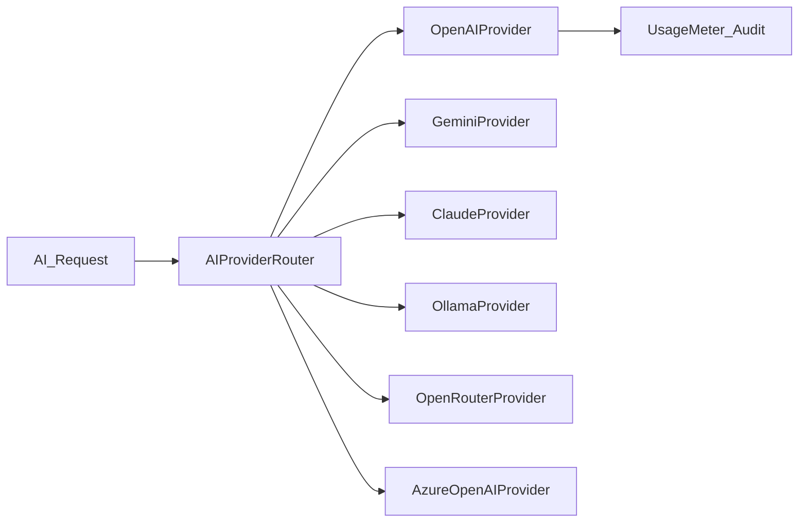
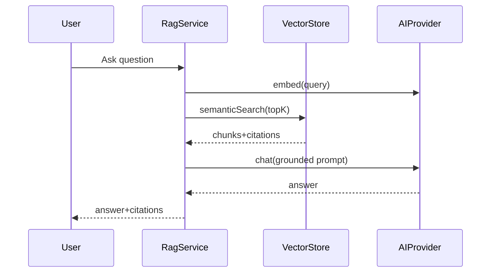
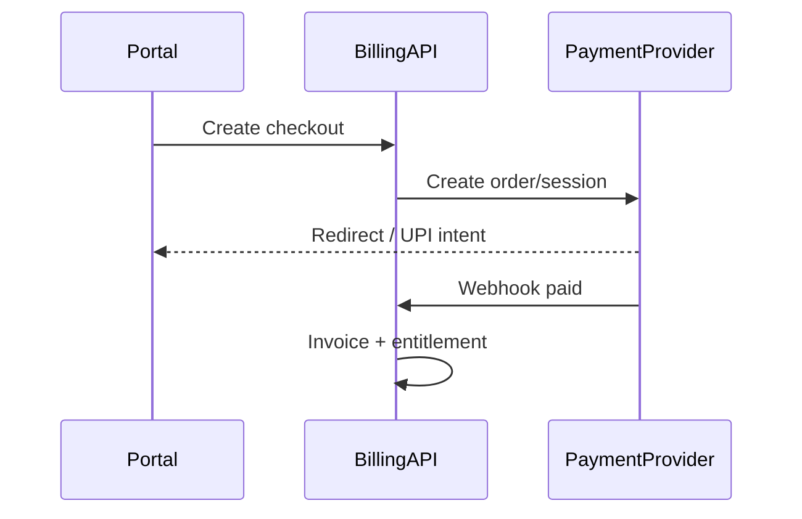
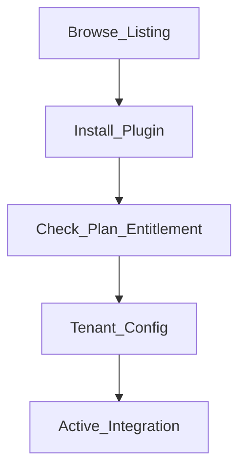

# MASTER-05 — Mermaid Diagrams

## AI provider routing

```mermaid
flowchart LR
  Req[AI_Request] --> Router[AIProviderRouter]
  Router --> OAI[OpenAIProvider]
  Router --> GEM[GeminiProvider]
  Router --> CLA[ClaudeProvider]
  Router --> OLL[OllamaProvider]
  Router --> OR[OpenRouterProvider]
  Router --> AZ[AzureOpenAIProvider]
  OAI --> Meter[UsageMeter_Audit]
```

## RAG answer flow

```mermaid
sequenceDiagram
  participant U as User
  participant API as RagService
  participant V as VectorStore
  participant AI as AIProvider
  U->>API: Ask question
  API->>AI: embed(query)
  API->>V: semanticSearch(topK)
  V-->>API: chunks+citations
  API->>AI: chat(grounded prompt)
  AI-->>API: answer
  API-->>U: answer+citations
```

## Payment checkout

```mermaid
sequenceDiagram
  participant Web as Portal
  participant API as BillingAPI
  participant P as PaymentProvider
  Web->>API: Create checkout
  API->>P: Create order/session
  P-->>Web: Redirect / UPI intent
  P->>API: Webhook paid
  API->>API: Invoice + entitlement
```

## Marketplace install

```mermaid
flowchart TB
  Browse[Browse_Listing] --> Install[Install_Plugin]
  Install --> Ent[Check_Plan_Entitlement]
  Ent --> Config[Tenant_Config]
  Config --> Active[Active_Integration]
```
